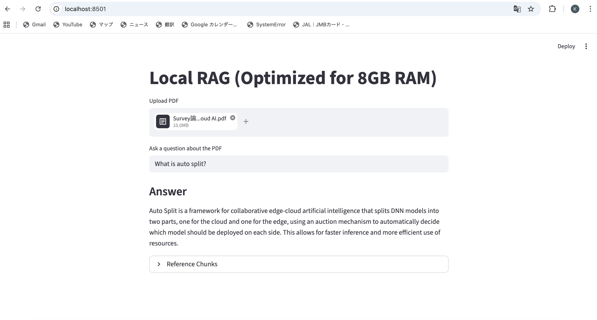

# Local RAG Pipeline with Docker + CI

A lightweight Retrieval-Augmented Generation (RAG) system built with Docker Compose, featuring separate LLM-serving and application containers.



## Features

- PDF upload and text extraction  
- Text chunking and embedding-based retrieval  
- FAISS vector search  
- Local LLM question answering via Ollama  
- Dockerized two-container architecture  
- GitHub Actions CI for automated validation  

## Tech Stack

Python, Streamlit, FAISS, SentenceTransformers, Docker Compose, Ollama, GitHub Actions

## Architecture

```text
User → Streamlit App → FAISS Retrieval → Ollama LLM → Answer
```

## Run Locally
```bash
docker compose up -d
docker exec -it <ollama-container> ollama pull phi
```

Then open:
http://localhost:8501

## CI

GitHub Actions automatically performs:
- Build Docker image
- Start containers
- Check Ollama API response
- Verify Streamlit startup

## Why This Project

Built to explore practical ML platform engineering under limited-memory constraints (8GB RAM), including:
- container orchestration
- local LLM inference
- retrieval pipelines
- automated CI testing
